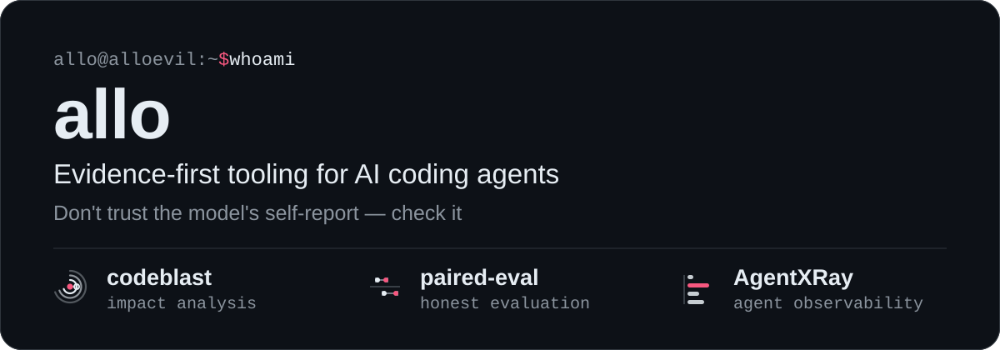

<p align="center">
  
</p>

<p align="center">
  <a href="https://github.com/alloevil?tab=repositories&sort=stargazers"></a>
  <a href="https://github.com/alloevil?tab=repositories&language=python"></a>
  <a href="https://github.com/alloevil?tab=repositories&language=typescript"></a>
</p>

<br/>

## 🧭 What I Do

> Every tool here exists because an LLM told me something that turned out to be false — a diagram that was the model's opinion, a judge score that could be bluffed, a "refactor" that dropped a symbol, a benchmark number with no source. So each one replaces a claim with a check.

<p align="center">
  
  &nbsp;
  
  &nbsp;
  
</p>

<p align="center">
  <b>Impact Analysis</b> &middot; Deterministic code graphs, mutation-tested recall, <code>file:line</code> on every edge<br/>
  <b>Honest Evaluation</b> &middot; Program gates before rubrics, paired statistics, verdicts that say what they can't rule out<br/>
  <b>Agent Observability</b> &middot; Read what the agent actually did — turn by turn, token by token
</p>

<br/>

## 🔭 Featured Projects

> Full index with every project, grouped by area: **[alloevil.github.io/projects](https://alloevil.github.io/projects/)**

<table>
<tr>
<td width="50%">

### 💥 codeblast
> Know what breaks before you merge — deterministic code graph with impact, change & architecture maps. Recall verified by mutation testing (tRPC, 950 files: 28/28).

`npx codeblast demo` &nbsp; `typescript` `impact-analysis` `agent-skill`

[→ Explore](https://github.com/alloevil/codeblast) · [Live demo](https://alloevil.github.io/codeblast/)

</td>
<td width="50%">

### 📐 paired-eval
> Evaluate models, agents and harnesses: program checks first, rubrics for the rest, honest paired statistics. Zero dependencies.

`pip install paired-eval` &nbsp; `python` `evaluation` `statistics`

[→ Explore](https://github.com/alloevil/paired-eval) · [Docs](https://alloevil.github.io/paired-eval/)

</td>
</tr>
<tr>
<td width="50%">

### 🔬 AgentXRay
> Web dashboard for AI agent session logs — Claude Code, Codex, OpenClaw, Hermes, OMP, Gemini CLI. Per-turn time / token / cost ledger.

`npx @alloevil/agent-xray` &nbsp; `javascript` `observability` `debugging`

[→ Explore](https://github.com/alloevil/AgentXRay)

</td>
<td width="50%">

### 🔍 coding-agent-internals
> How 12 coding agents *implement* search, edit, LSP, DAP and sub-agents — shell-fork vs in-process, `str_replace` vs hash-anchored. Ceilings, not checklists.

`research` `claude-code` `codex` `omp`

[→ Explore](https://github.com/alloevil/coding-agent-internals)

</td>
</tr>
<tr>
<td width="50%">

### 🧾 agents-with-receipts
> Evidence-first agentic coding: a cell-by-cell verified cross-tool table, a sourced practices map, and an `AGENTS.md` linter.

`practices` `agents-md` `linter`

[→ Explore](https://github.com/alloevil/agents-with-receipts)

</td>
<td width="50%">

### 🧪 deepresearch-arms-lab
> 14-arm ablation of deep research pipelines on a weak base model — negative results left in, n=15 re-validation.

`ablation-study` `llm-evaluation` `negative-results`

[→ Explore](https://github.com/alloevil/deepresearch-arms-lab)

</td>
</tr>
</table>

<br/>

## 📚 Recently Reading

<!-- BLOG-POST-LIST:START -->
- [高效电商 AI 智能体解剖指南 | 选自 Anthropic 的 Claude 博客](https://baoyu.io/translations/2026-09-02/the-anatomy-of-effective-commerce-agents)
- [AI 原生思维——像训练大模型一样训练自己](https://baoyu.io/blog/2026-08-31/ai-native-thinking)
- [Warp 如何让 Agent 自我进化](https://baoyu.io/blog/2026-08-28/warp-self-improving-agents)
- [我的 AI 原生开发流程：一个真实案例的完整复盘](https://baoyu.io/blog/2026-08-24/ai-native-dev-workflow)
- [从 TL 到 EM：我终于不再盯着 AI 写代码了](https://baoyu.io/blog/coding-agent-em-shift)
<!-- BLOG-POST-LIST:END -->

## 🛠️ Tech Stack

<p align="center">
  
  
  
  
  
  
  
  
  
  
  
</p>

<br/>

## 📊 Evidence, Not Widgets

> These cards are rendered daily from the tools' own outputs — a real repo's dependency graph, the latest mutation-testing run, a real session's per-turn ledger. Same numbers as the tools print.

<table align="center"><tr>
<td valign="top" width="420">
<a href="https://alloevil.github.io/codeblast/tabby-arch.html"></a>
</td>
<td valign="top" width="480">
<a href="https://github.com/alloevil/codeblast/tree/main/eval"></a>
<br/><br/>
<a href="https://github.com/alloevil/AgentXRay"></a>
</td>
</tr></table>

<br/>

<picture align="center">
  <source media="(prefers-color-scheme: dark)" srcset="https://raw.githubusercontent.com/alloevil/alloevil/output/github-contribution-grid-snake.svg">
  <source media="(prefers-color-scheme: light)" srcset="https://raw.githubusercontent.com/alloevil/alloevil/output/github-contribution-grid-snake.svg">
  
</picture>


<!--START_SECTION:waka-->


**I'm an Early 🐤** 

```text
🌞 Morning                1860 commits        █████████████░░░░░░░░░░░░   52.74 % 
🌆 Daytime                1380 commits        ██████████░░░░░░░░░░░░░░░   39.13 % 
🌃 Evening                275 commits         ██░░░░░░░░░░░░░░░░░░░░░░░   07.80 % 
🌙 Night                  12 commits          ░░░░░░░░░░░░░░░░░░░░░░░░░   00.34 % 
```
📅 **I'm Most Productive on Monday** 

```text
Monday                   1649 commits        ████████████░░░░░░░░░░░░░   46.75 % 
Tuesday                  226 commits         ██░░░░░░░░░░░░░░░░░░░░░░░   06.41 % 
Wednesday                193 commits         █░░░░░░░░░░░░░░░░░░░░░░░░   05.47 % 
Thursday                 528 commits         ████░░░░░░░░░░░░░░░░░░░░░   14.97 % 
Friday                   188 commits         █░░░░░░░░░░░░░░░░░░░░░░░░   05.33 % 
Saturday                 58 commits          ░░░░░░░░░░░░░░░░░░░░░░░░░   01.64 % 
Sunday                   685 commits         █████░░░░░░░░░░░░░░░░░░░░   19.42 % 
```


📊 **This Week I Spent My Time On** 

```text
🕑︎ Time Zone: Asia/Shanghai

💬 Programming Languages: 
Python                   7 hrs 28 mins       ██████████░░░░░░░░░░░░░░░   39.73 % 
Markdown                 3 hrs 36 mins       █████░░░░░░░░░░░░░░░░░░░░   19.17 % 
JavaScript               3 hrs 11 mins       ████░░░░░░░░░░░░░░░░░░░░░   16.94 % 
TypeScript               1 hr 8 mins         ██░░░░░░░░░░░░░░░░░░░░░░░   06.04 % 
Other                    52 mins             █░░░░░░░░░░░░░░░░░░░░░░░░   04.64 % 

🔥 Editors: 
OMP                      14 hrs 48 mins      ████████████████████░░░░░   78.61 % 
Cursor                   2 hrs 17 mins       ███░░░░░░░░░░░░░░░░░░░░░░   12.19 % 
Claude Code              1 hr 33 mins        ██░░░░░░░░░░░░░░░░░░░░░░░   08.31 % 
Unknown Editor           8 mins              ░░░░░░░░░░░░░░░░░░░░░░░░░   00.72 % 
Agent                    1 min               ░░░░░░░░░░░░░░░░░░░░░░░░░   00.17 % 

🐱‍💻 Projects: 
isc-world-model          4 hrs 30 mins       ██████░░░░░░░░░░░░░░░░░░░   23.93 % 
wca                      2 hrs 54 mins       ████░░░░░░░░░░░░░░░░░░░░░   15.46 % 
chainsentry-ai           2 hrs 3 mins        ███░░░░░░░░░░░░░░░░░░░░░░   10.97 % 
AgentXRay                1 hr 25 mins        ██░░░░░░░░░░░░░░░░░░░░░░░   07.55 % 
llm-benchmarks-tracker   1 hr 22 mins        ██░░░░░░░░░░░░░░░░░░░░░░░   07.28 % 

💻 Operating System: 
Linux                    18 hrs 49 mins      █████████████████████████   100.00 % 
```

**I Mostly Code in Python** 

```text
Python                   14 repos            ████████░░░░░░░░░░░░░░░░░   33.33 % 
JavaScript               10 repos            ██████░░░░░░░░░░░░░░░░░░░   23.81 % 
TypeScript               9 repos             █████░░░░░░░░░░░░░░░░░░░░   21.43 % 
HTML                     4 repos             ██░░░░░░░░░░░░░░░░░░░░░░░   09.52 % 
SCSS                     1 repo              █░░░░░░░░░░░░░░░░░░░░░░░░   02.38 % 
```


 Last Updated on 11/09/2026 01:53:47 UTC
<!--END_SECTION:waka-->

<br/>

<p align="center">
  
</p>
